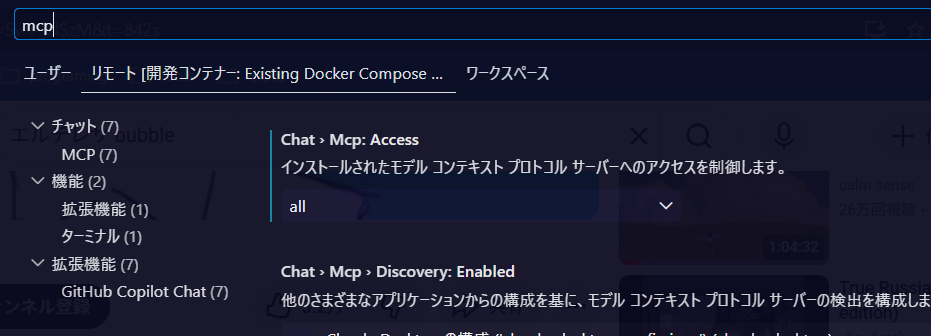
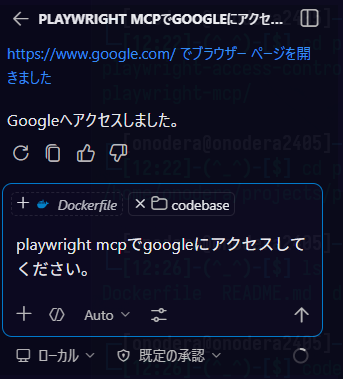
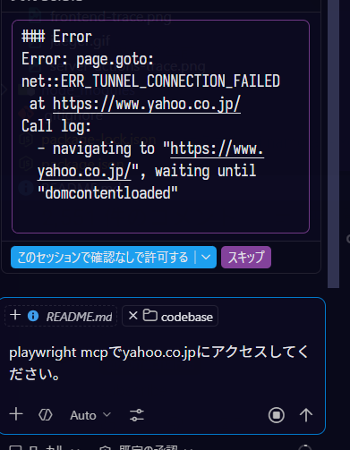

# Playwright mcpサーバーのアクセス制御検証用リポジトリ

## 起動方法

### 1. Devcontainerを起動
Devcontainerを起動します。

### 2. Vscodeの設定確認
Vscodeの設定でmcpサーバーの利用が許可されていることを確認します。
chat.mcp.accessがallまたはregistry(組織アカウントで選択可)である必要があります。

### 3. mcpサーバーの起動確認
playwright mcpサーバーが起動していることを確認してください。

### 4. チャットで検証する

google.comのドメインは許可しているので到達できるが、それ以外はアクセスできないことを確認します。

#### google.comの場合

#### yahoo.co.jpの場合

